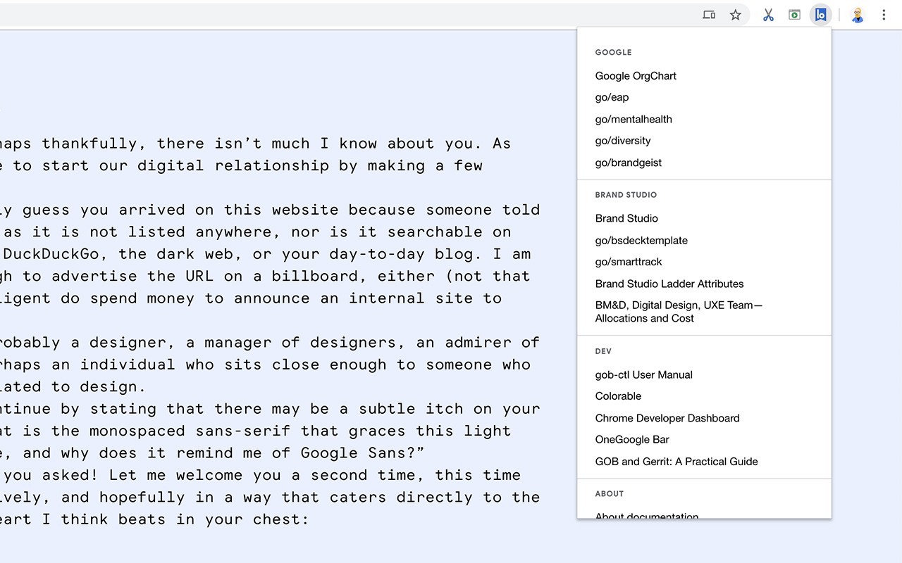
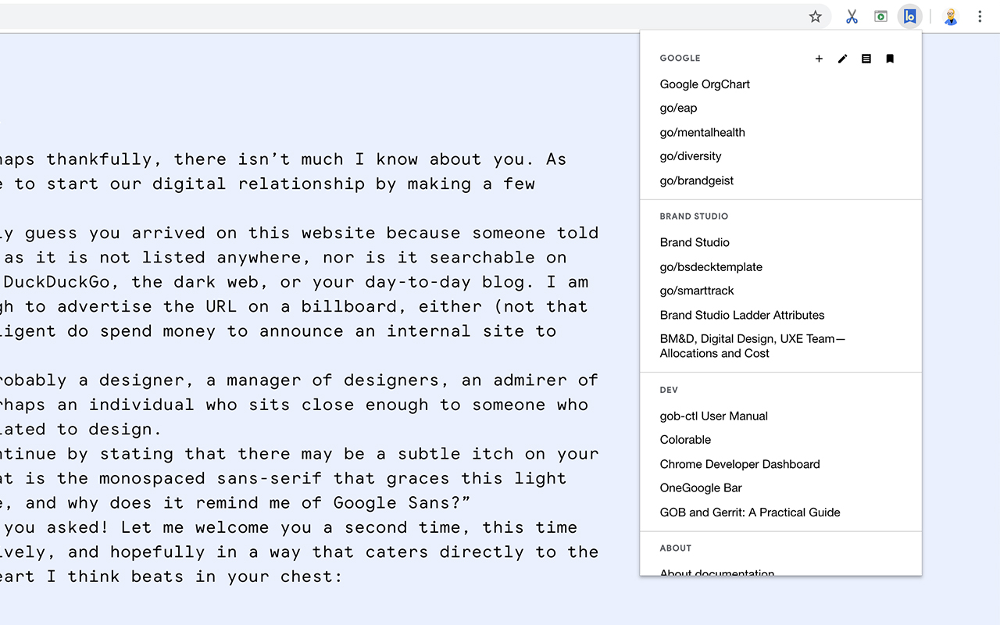
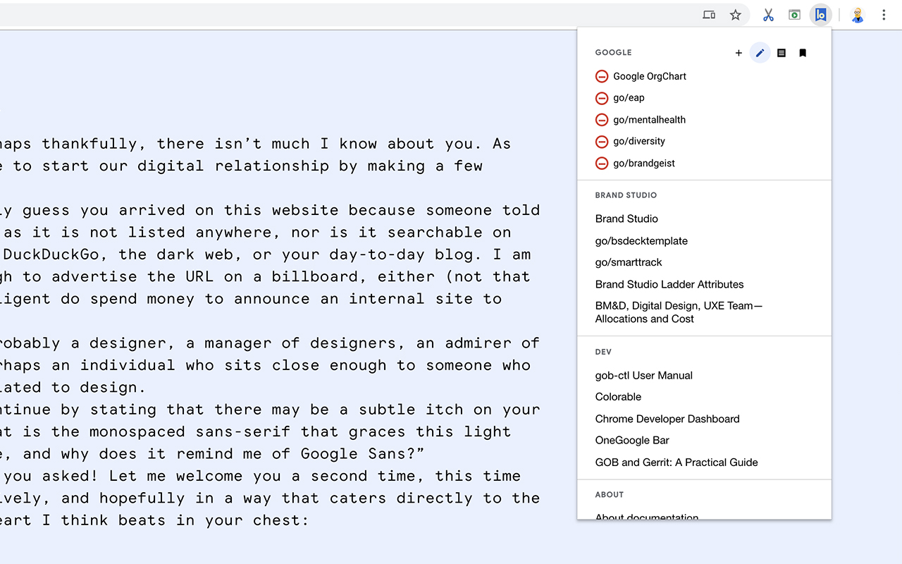
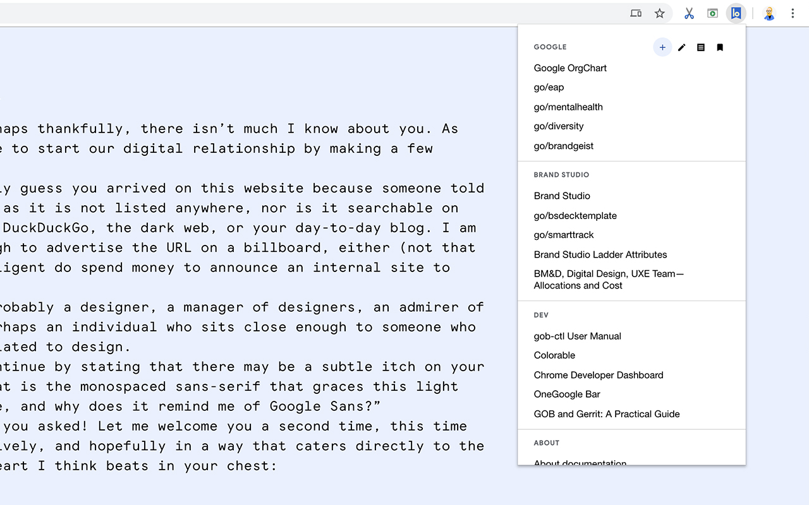
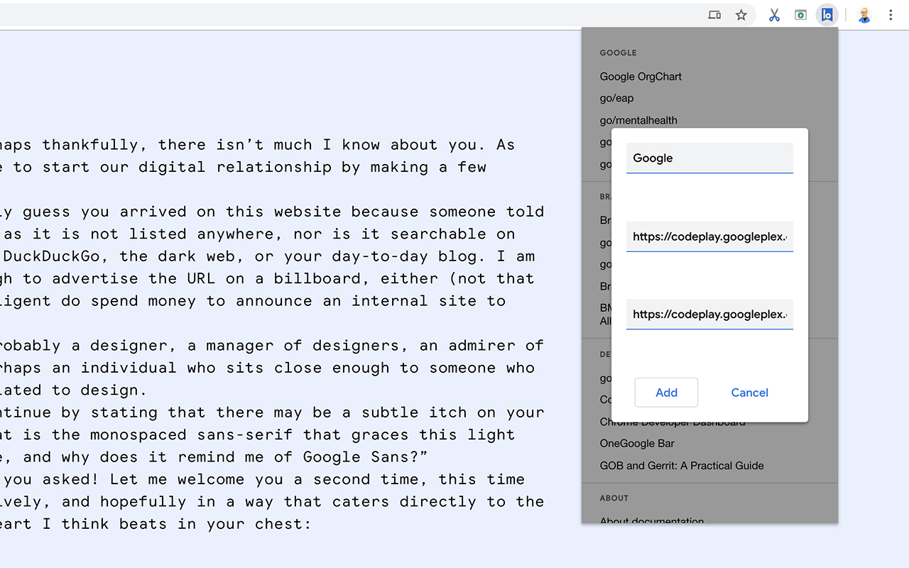

# Bookie

### Bookie is a [Chrome Extension](https://chrome.google.com/webstore/detail/bookie/bfjfkconjpndkfkjinlahajgnlkbdkgp) you can use to create a curated set of bookmarks and associated markdown notes, accessible within the Chrome menubar.





**Manage content**

Bookmarks can be added or removed directly within the Bookie dropdown menu.

- "+" Adds bookmarks, and will automatically populate with info from the current tab (e.g. title and URL).
- "pen" Remove item from group.
- "note" Add/edit notes with Markdown.
- "bookmark" Organize within Chrome bookmarks native UI.
- "tab" Open all bookmarks within category in a tab group.





**Manage bookmarks natively**

The bookmarks within Bookie are simply Chrome bookmarks stored in a folder called "Bookie". You can manage the entries for Bookie within the menu itself (via edit and add options) or simply through the native Chrome bookmarks UI.




**Add related notes**

You can also add additional notes to accompany each category, these notes are stored within local storage and are accessible by you. But they will sync across all devices when logged into Chrome. Formatting of notes is handled with markdown, simply clicking on the text box exposes the underlying markdown.




---
## Installation

**Chrome Store**

1. Visit [Chrome store](https://chrome.google.com/webstore/detail/bookie/bfjfkconjpndkfkjinlahajgnlkbdkgp)
2. Et voilà!

**Developer**

1. Select ```Extensions``` under the ```Tools``` menu or go to [chrome://extensions](chrome://extensions).
2. Ensure that the ```Developer mode``` checkbox in the top right-hand corner is checked.
3. Click ```Load unpacked extension...``` to pop up a file-selection dialog.
4. Navigate to the ```/src``` directory of this repo or drag and drop the ```/src``` directory onto the opened [chrome://extensions](chrome://extensions) tab.

---
## Build

| Command | Description |
|-|-|
| `$ npm run dev`   | Spin up Webpack watch task and development server ([0.0.0.0:1112](http://0.0.0.0:1112)) |
| `$ npm run build` | Compile (and uglify) |
| `$ npm run package:chrome` | Compile (and uglify) necessary files into .zip only for Chrome |
| `$ npm run package:firefox` | Compile (and uglify) necessary files into .zip only for Firefox |

